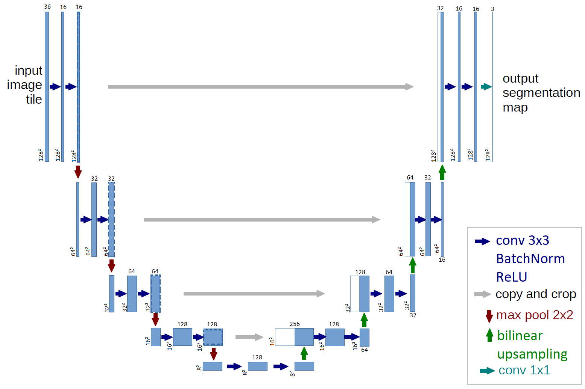

# rain-nowcasting-using-deep-learning

This repository aims at expliciting the training procedure of the deep learning model presented in the paper "Merging radar rain images and wind predictions in a deep learning model applied to rain nowcasting". The paper aims at training a neural network to forecast precipitations at short and mid-term horizon by combining rain radar data to predictions of wind speed made by weather forecast models.


___

## Demonstrator

* Downloading the directory:
```
git clone https://gitlab.com/Vincentbouget/rain-nowcasting-using-deep-learning.git
```

* Installing python modules (with pyenv) and downloading data:
```
./setup.sh
```

* Training the model and performing forecast:
```
./run_jupyter.sh
```

## The data

The data used to train the network is the MeteoNet database (https://meteonet.umr-cnrm.fr/) which provides meteorogical parameters over the French territory from 2016 to 2018, for detailed information about pre-processing see the paper. The whole database being too large for a simple demonstrator, **we provide pre-processed data for February and March of 2016, 2017 and 2018**. The pre-processed data of rain and wind can be directly downloaded at https://www-pequan.lip6.fr/~bereziat/rain-nowcasting/data.tar.gz (data are downloaded by `./setup.sh`). 

## Usage of this repository

`Train.ipynb` is a jupyter notebook presenting the training procedure. First be sure to fulfill the requirements specified in `requirements.txt`, then download the data and patches, finally you can tune the training parameters to impact the training process.

## Visualizing

During the training process several parameters are saved (loss, F1 score, inputs, predictions...) and can be visualized in real time using tensorboard. The command is detailed in the "Visualizing results" cell in `train.py`.

## Model

The model used is similar to a UNet, the architecture is presented in the following image :



We provide pre-trained models for predictions at 30 minutes and 1 hour in 'weights' directory.

